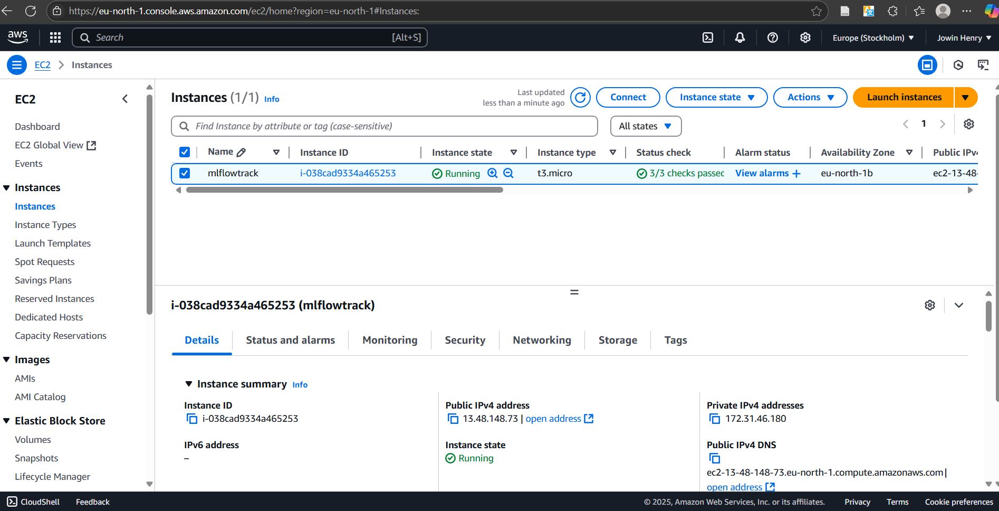
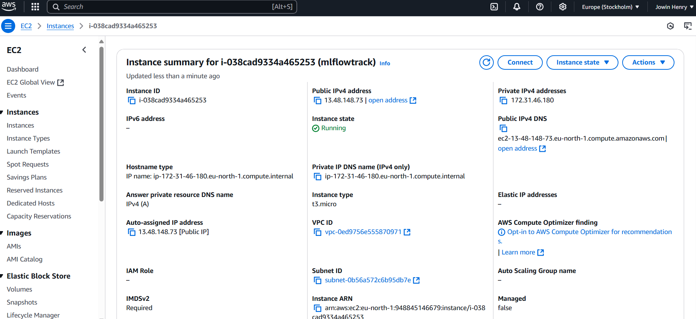
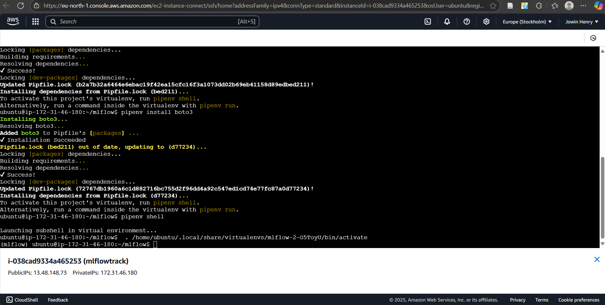
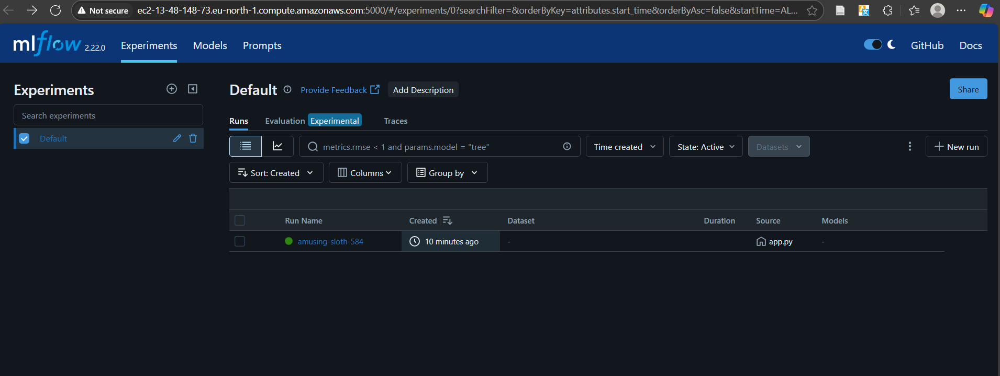

# 🚀 MLflow on AWS Setup 

**Goal** : To deploy an MLflow tracking server on AWS using an EC2 instance and S3 for artifact storage.

---

## 🧰 Prerequisites

* An active AWS account


---

## 🔐 1. Create IAM User with Admin Access

1. Go to **IAM Console** → **Users**
2. Create a new user with **Programmatic Access**
3. Attach **AdministratorAccess** policy
4. Save the **Access Key ID** and **Secret Access Key**


---

## 💻 2. Configure AWS CLI Locally

```bash
aws configure
```

Enter your saved access key and region (e.g. `eu-north-1`).

---

## ☁️ 3. Create S3 Bucket

1. Open the **S3 Console**
2. Create a new bucket (e.g. `mlflowtrack`)
3. Uncheck **Block all public access** if you want to make artifacts public (optional)


---

## 🖥️ 4. Launch EC2 Instance (Ubuntu)

1. Choose **Ubuntu 22.04 LTS**
2. Select instance type (e.g. `t2.micro` for testing)
3. Create a security group with **port 5000** open (for MLflow UI)
4. Launch and connect via SSH

📸 


---

## ⚙️ 5. Setup MLflow on EC2

```bash
# Update packages
sudo apt update

# Install Python tools
sudo apt install python3-pip virtualenv -y

# Install pipenv
sudo pip3 install pipenv

# Create project directory
mkdir mlflow && cd mlflow

# Setup environment
pipenv install mlflow awscli boto3

# Activate shell
pipenv shell
```

---

## 🔐 6. Configure AWS CLI in EC2

Inside the `pipenv` shell:

```bash
aws configure
```

Enter the same credentials again for your EC2 environment.

---

## 🚀 7. Run the MLflow Tracking Server

```bash
mlflow server \
  --host 0.0.0.0 \
  --port 5000 \
  --default-artifact-root s3://mlflowtrack1
```

MLflow UI will now be available at:

```bash
http://<EC2-Public-DNS>:5000
```


---

## 🔗 8. Connect Your Local MLflow Client

On your local machine or in your Python code:

```bash
export MLFLOW_TRACKING_URI=http://<EC2-Public-DNS>:5000
```

Now all your experiments will log remotely to your MLflow server on AWS.



---
---

## 🔄 9. CI/CD and Containerization 

For automating deployment, testing, and containerizing using **GitHub Actions** and **Docker**, check out this repo:

👉 [CI/CD with GitHub Actions & Docker](https://github.com/jowin-henry/dockerimagehub)

This repo contains:

- Dockerfile containerization
- GitHub Actions workflows to build, test, and deploy your container to AWS  
- Best practices for continuous integration and continuous deployment  

---

## ✅ Done!

Successfully deployed an **MLflow tracking server** on AWS with:

* S3 for artifact storage
* EC2 for hosting

---


